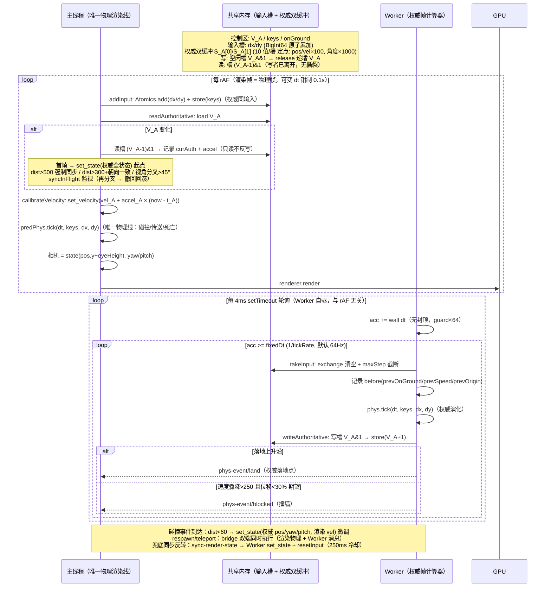

# WebSurf「渲染帧 vs 权威帧」实现深度分析

> 分析范围：`D:\code\projects\websurf` 下 `debug/`（WebSurf-debug）与 `game/`（WebSurf-game）两套工程的渲染帧/权威帧完整实现链路。
> 所有结论均基于实际代码（引用 `文件:行号`），非臆测。临时分析文档，供后续参考。
>
> **⚠ 历史快照（2026-08-09 晚标注）**：本文写于 22aa6d5 之后、0f3558b 之前。debug 侧的 shared-state.ts/physics-loop.ts 已删（现共享 src/ts-shared/auth/），debug 已切换为 game 同构架构（主线程唯一物理渲染线 + 单 Worker 权威帧）；B 章（game 架构）的内容判断大体仍正确，但路径/行号已公共化迁移。

---

## 目录

- [A. debug 端：主线程渲染帧 vs Worker 物理帧](#a-debug端主线程渲染帧-vs-worker-物理帧)
  - [A.1 共享内存布局（shared-state.ts）](#a1-共享内存布局shared-statets)
  - [A.2 Worker 物理帧：frame() 固定步长链路（physics-loop.ts）](#a2-worker-物理帧frame-固定步长链路physics-loots)
  - [A.3 主线程渲染帧：readFrame + 双快照 LERP + 外推（renderer-main.ts）](#a3-主线程渲染帧readframe--双快照-lerp--外推renderer-maints)
  - [A.4 渲染帧与物理帧的频率解耦方式](#a4-渲染帧与物理帧的频率解耦方式)
  - [A.5 传送/重生/模式切换的重置](#a5-传送重生模式切换的重置)
  - [A.6 debug 时序图（mermaid）](#a6-debug-时序图mermaid)
- [B. game 端：主线程唯一物理渲染线 vs Worker 权威帧](#b-game端主线程唯一物理渲染线-vs-worker-权威帧)
  - [B.1 SAB 布局与读写协议（shared-state.ts）](#b1-sab-布局与读写协议shared-statets)
  - [B.2 Worker 权威帧循环（main.ts）](#b2-worker-权威帧循环maints)
  - [B.3 主线程渲染帧：读权威 → 速度校准 → tick → 渲染（renderer-main.ts）](#b3-主线程渲染帧读权威--速度校准--tick--渲染renderer-maints)
  - [B.4 权威帧与渲染帧各自的 dt 语义 / accel 计算](#b4-权威帧与渲染帧各自的-dt-语义--accel-计算)
  - [B.5 respawn / teleport 双端同步时机](#b5-respawn--teleport-双端同步时机)
  - [B.6 game 时序图（mermaid）](#b6-game-时序图mermaid)
- [C. 两端对比与差异](#c-两端对比与差异)
  - [C.1 本质差异](#c1-本质差异)
  - [C.2 频率 / 同步 / 防撕裂 / 异常处理对比表](#c2-频率--同步--防撕裂--异常处理对比表)
  - [C.3 关键文件与行号索引](#c3-关键文件与行号索引)

---

# A. debug 端：主线程渲染帧 vs Worker 物理帧

> 架构总览：Worker 是**物理单一权威源**（WASM Rust `PhysWorld`，固定步长），主线程只做**输入写入 + LERP 插值渲染**。
> 渲染已搬回主线程（`RendererMain`），Worker 不渲染。跨线程数据全部走 SharedArrayBuffer（无 COOP/COEP 时降级 postMessage `MsgState`）。

## A.1 共享内存布局（shared-state.ts）

文件：`debug/src/worker/shared-state.ts`

### 内存布局（字节偏移）

| 区 | 索引 | 内容 | 代码位置 |
|---|---|---|---|
| Int32 控制区（0-31 字节） | `I_LOCK=0` | 输出写锁（1=Worker 写中） | shared-state.ts:97 |
| | `I_OUT_SEQ=1` | 输出版本号（Worker 写完 ++） | shared-state.ts:98 |
| | `I_IN_HEAD=2` | 输入环 head（消费者推进） | shared-state.ts:99 |
| | `I_IN_TAIL=3` | 输入环 tail（生产者推进；notify/wait 目标） | shared-state.ts:100 |
| | `I_ONGROUND=4` | onGround（0/1） | shared-state.ts:101 |
| | `I_MODE=5` | 物理模式（0=noclip 1=physics） | shared-state.ts:102 |
| Float64 输出区（32 字节起，8 对齐） | `F_POS_X..F_EYE_HEIGHT=4..13` | pos.x/y/z / yaw / pitch / vel.x/y/z / timeMs / eyeHeight（10 值） | shared-state.ts:106-115 |
| 环形缓冲（SOA，112 字节起） | `RING_DXS_BYTE=112` / `RING_DYS_BYTE=624` / `RING_TSS_BYTE=1136`（Float64×64）+ `RING_KEYS_BYTE=1648`（Int32×64） | dxs / dys / tss / keys 四数组 | shared-state.ts:129-132 |

- `RING_CAPACITY=64`（2 的幂，槽址 `& (RING_CAPACITY-1)` 免取模）shared-state.ts:118-119
- 总大小 `SHARED_BUFFER_SIZE=1904` 字节 shared-state.ts:135
- `NOTIFY_THRESHOLD=8`：积压 ≥8 样本 → `Atomics.notify`（仅唤醒信号，无数据）shared-state.ts:126

### 输入环形缓冲（SPSC 无锁）内存序

- **写者（主线程）** `pushSample`：先写 4 个槽数据（普通写）→ `this.tail += 1` → `Atomics.store(I_IN_TAIL, tail)`（release 语义）→ 若 `tail - load(I_IN_HEAD) >= 8` 则 `Atomics.notify(I_IN_TAIL, 1)` shared-state.ts:244-256
- **读者（Worker）** `takeInput`：`Atomics.load(I_IN_TAIL)`（acquire 语义）→ 批量读 `[head, tail)` 快照，`sumDx/sumDy` 聚合求和、`keys` 取批次内最新、记录 `firstTs/lastTs` → `head += n` → `Atomics.store(I_IN_HEAD, head)` shared-state.ts:258-292
- **覆盖降采样**：写者只写"当前 tail 槽"，不读 head 排空；积压时读者读上限 `min(count, RING_CAPACITY)`，防回绕重读——消费者跟不上时自动丢弃最旧、保留最新 64 样本（shared-state.ts:239-240 注释 + :266）
- 空批次（count≤0）：返回缓存按键状态 `lastKeys`、增量归零 shared-state.ts:262-264

### 输出 seqlock（写锁 + seq 校验）

- **写者** `writeFrame`：`Atomics.store(I_LOCK, 1)` → 写 10 个 Float64 → `Atomics.store(I_ONGROUND, ...)`、`I_MODE` → `Atomics.store(I_OUT_SEQ, seq)` → `Atomics.store(I_LOCK, 0)` shared-state.ts:294-311
- **读者** `readFrame`（主线程渲染帧）：
  1. 前置检查：`load(I_LOCK) === 1` → 返回 `null`（复用上一帧缓存）shared-state.ts:315
  2. 读 `seqA = load(I_OUT_SEQ)` → 读全部输出值 shared-state.ts:316-327
  3. 后置校验：再查锁占用 → `null`；再查 `load(I_OUT_SEQ) !== seqA` → `null`（写者已开始下一轮 → 数据可能不完整，丢弃）shared-state.ts:329-330

> 注：JS `Atomics.store/load` 均为 seq_cst，"release/acquire" 是语义近似（../../debug/docs/timing-debug.md:16 注释）。

### MsgState 回退（无 crossOriginIsolated）

- `MsgStateMain`：`setInput`/`setKeys` → postMessage `input`；`readFrame` 返回 `cached`（Worker 回传 `phys-frame` 缓存）shared-state.ts:344-386
- `MsgStateWorker`：`setPendingInput` 累加 dx/dy、覆盖 keysMask；`takeInput` 读清增量；`writeFrame` → postMessage `phys-frame` shared-state.ts:389-431
- 工厂：`createMainSharedState`（buffer 非空 → ShmState）、`createWorkerSharedState` shared-state.ts:438-451

## A.2 Worker 物理帧：frame() 固定步长链路（physics-loop.ts）

文件：`debug/src/worker/physics-loop.ts`

### 常量

- `FIXED_DT = 1/64`（默认 64Hz）physics-loop.ts:30
- `MAX_FIXED_STEPS = 10`（每帧最多固定步数，低帧率保护）physics-loop.ts:32
- `M_YAW = 0.022`（cs-movement m_yaw deg/count）physics-loop.ts:26；`PITCH_CLAMP_DEG = 89` physics-loop.ts:28

### frame() 完整时序（physics-loop.ts:180-218）

1. **dt 计算**：`now = performance.now()`；`dt = lastFrameT === 0 ? 0 : Math.min((now - lastFrameT)/1000, 0.1)`（钳制 0.1s）physics-loop.ts:181-183
2. **takeInput 批量聚合**：`shared.takeInput()` → `keys = maskToKeys(input.keysMask)` physics-loop.ts:186-187
3. **灵敏度换算**：`frameDx = input.dx * sens`（`sens = config.input.sensitivity ?? 1.5`）；Rust 端 sensitivity 固定 1 physics-loop.ts:191-193
4. **固定步长累积器**：
   - `moveAccumulator += dt`，然后**封顶** `min(acc, fixedDt * MAX_FIXED_STEPS)`（低帧率只补最多 10 步，丢物理时间防螺旋）physics-loop.ts:196-197
   - `firstStep = true`；`while (acc >= fixedDt)`：`acc -= fixedDt` → `stepFixed(fixedDt, frameDx, frameDy)` → `didPhysicsTick = true` physics-loop.ts:199-204
5. **noclip 分支**：非 physics 模式把鼠标增量应用到 `noclipView`（`applyNoclipMouseDelta`，pitch clamp ±89°）physics-loop.ts:207-209, 276-284
6. **writeFrame**：写共享输出区（见 A.1 seqlock）physics-loop.ts:212
7. **onAfterPhysics 回调**：`(dt, didPhysicsTick)` → 游戏计时 / 物理事件消费 / 10Hz stats physics-loop.ts:215-217

### stepFixed：首步鼠标增量语义（physics-loop.ts:221-236）

- **Q/E 等效像素**：`qePx = yawDir * (yawBindSpeed * dt) / M_YAW`（独立增量，不受灵敏度影响）physics-loop.ts:224-225
- **firstStep 标志**：鼠标增量（frameDx/frameDy）**仅首步应用**（每帧一次），Q/E 每步都计入；随后 `firstStep = false` physics-loop.ts:228-230
- physics 模式：`phys.tick(dt, keysMask, dx, dy)`（Rust 完整物理：移动/碰撞/传送检测/死亡重生）physics-loop.ts:231
- noclip 模式：`noclipStep`（纯 TS 自由飞行，YXZ 数学构造方向）physics-loop.ts:234, 246-273

### writeFrameInternal（physics-loop.ts:289-326）

- physics 模式：读 `phys.state()`（pos/yaw/pitch/vel/onGround/eyeHeight）physics-loop.ts:298-305
- noclip 模式：读 `noclipView`（vel=0, onGround=false, eyeHeight=0）physics-loop.ts:306-313
- 时间戳：`timeMs = this.lastFrameT`（**Worker 侧 performance.now() 基准**，与主线程同源时钟——LERP 插值基准不变）physics-loop.ts:323
- 版本号：`seq: ++this.seq` physics-loop.ts:324

### Worker 驱动方式（信号驱动，非自驱）

- 主线程每 rAF 发一条 `frame` 触发信号（无数据负载）`debug/src/input/input-bridge.ts:43-45`、`debug/src/app.ts:1448`
- Worker：`handleFrame → physicsLoop.frame()` `debug/src/worker/physics-worker.ts:430-433`
- 注意：**物理固定步长是"固定"的（1/tickRate），但 frame() 的调用频率跟随 rAF**；dt 由 Worker 自算（`performance.now()`），注释预留 M2 Worker 自驱轮询（`Atomics.wait` + notify）作为后续方案（shared-state.ts:30-34）

## A.3 主线程渲染帧：readFrame + 双快照 LERP + 外推（renderer-main.ts）

文件：`debug/src/renderer/renderer-main.ts`

### 外推常量

- `EXTRAPOLATE_MAX_S = 1/64`：外推上限约一个物理固定步（防物理真卡时外推跑飞穿墙）renderer-main.ts:57
- `EXTRAPOLATE_MIN_SPEED = 500`：横向（x/z）与竖向（y）速度**均**低于此值时不外推（起步拉地速阶段运动不可预测）renderer-main.ts:63

### tick() 渲染帧时序（renderer-main.ts:370-447）

1. **readFrame 安全读取**：`shared.readFrame()`；锁占用 → null（本帧复用缓存）renderer-main.ts:376
2. **双快照维护**：`if (snap && snap.seq !== this.lastSeq)` → `prevSnap = curSnap; curSnap = snap; lastSeq = snap.seq` renderer-main.ts:377-381
   - 只有 seq 变化才推进快照窗口；同 seq 帧（Worker 写帧频率 < 渲染频率时）跳过——**LERP 窗口只覆盖有真实新物理数据的区间**
3. **LERP 插值 + 相机同步**：`render = this.interpolate(now)` renderer-main.ts:386
   - `cc.setYawPitch(render.yaw * DEG2RAD, render.pitch * DEG2RAD, false)` + `cc.update()` renderer-main.ts:388-389
   - **相机位置 = `pos.y + eyeHeight`**（眼睛高度，不做位置修正——防穿墙靠近平面自适应）renderer-main.ts:391-392
4. 近平面自适应（每 2 帧、仅 physics 模式）renderer-main.ts:397-400
5. LOD/PVS 剔除、雾、碰撞箱可视化、准星射线（限流 6 帧一次）renderer-main.ts:406-431
6. **无条件渲染**：`shouldRender = curSnap !== null || needsRender` → `renderer.render(...)`（帧率跟随 rAF，不降频/限流）renderer-main.ts:436-440

### interpolate()：LERP + dead-reckoning 外推（renderer-main.ts:462-513）

```
alpha = (now - prev.timeMs) / (cur.timeMs - prev.timeMs)   // >1 = 物理帧过期
```

- 守卫：`!prev || cur.timeMs <= prev.timeMs → return cur`（时间倒退/无历史 → 直接取最新快照，不做插值）renderer-main.ts:465
- **alpha ≤ 1（正常窗口）**：pos/yaw/pitch/eyeHeight 全部 `lerp(prev, cur, alpha)`；vel/onGround/mode/seq 取 cur；timeMs 取 now renderer-main.ts:498-512
- **alpha > 1（物理帧过期）**：
  - 速度门限：`speedXZ = hypot(vel.x, vel.z)`、`speedY = |vel.y|`；**两者均 < 500 → return cur**（退回最新快照停等，等价旧实现 clamp 到 1）renderer-main.ts:474-478
  - 外推：`extSec = min((now - cur.timeMs)/1000, EXTRAPOLATE_MAX_S)`；`pos = cur.pos + cur.vel * extSec`（一阶积分）；yaw/pitch 保持 cur（由输入驱动、外推无意义）renderer-main.ts:480-495
- 设计动机：物理 64Hz 固定步但快照随渲染频率写入，存在"空快照"窗口 + 消息延迟抖动 → alpha 间歇性 >1；旧实现 clamp 到 1 停等造成"停-动-停"微卡顿，外推让中间帧保持连续运动（renderer-main.ts:454-460 注释）

### resetInterpolation（renderer-main.ts:733-737）

```ts
resetInterpolation(): void {
  this.prevSnap = null;
  this.curSnap = null;
  this.lastSeq = -1;
}
```

- 调用点：仅 `disposeScene()`（卸载旧地图资源时，避免跨地图 LERP 瞬移）renderer-main.ts:226

## A.4 渲染帧与物理帧的频率解耦方式

| 机制 | 说明 | 代码 |
|---|---|---|
| 物理固定步长 | Worker `frame()` 内累积器以 `fixedDt=1/tickRate` 推进（默认 64Hz，面板 48-128 可调，`setTickRate`） | physics-loop.ts:65, 80-82, 123-125, 196-204 |
| frame 信号驱动 | 主线程每 rAF 发 `frame` 信号，Worker 才跑一轮 frame()——物理帧率上限 = 渲染帧率，但步长固定 | input-bridge.ts:43-45；physics-worker.ts:430-433 |
| 渲染 rAF 无上限 | 渲染帧率完全跟随 rAF（60-144Hz+），不降频/限流 | renderer-main.ts:436-440 |
| 快照 timeMs 基准 | 快照时间戳 = Worker `performance.now()`（lastFrameT），与主线程同源时钟；渲染侧用 `now`（rAF 时间戳）算 alpha | physics-loop.ts:323；renderer-main.ts:467 |
| LERP + 外推 | 渲染帧率 > 物理帧率时在双快照间插值；物理帧过期（alpha>1）时按速度一阶外推（上限 1/64s、速度门限 500） | renderer-main.ts:462-513 |

## A.5 传送/重生/模式切换的重置

| 场景 | Worker 侧 | 主线程侧 | 代码 |
|---|---|---|---|
| respawn | `handleRespawn`：游戏模式回退最后检查点（`game.getRespawnPos` → `phys.teleport_to`）否则 `phys.respawn()`；`setView` 同步视角；noclip 同步 noclipView；`onTeleport()` 清累积器 | 渲染侧无显式重置；新快照（seq++）到达后 LERP 窗口自然更新 | physics-worker.ts:454-471；physics-loop.ts:146-148 |
| teleport（spawn 索引） | `handleTeleport`：`phys.teleport_to_spawn(msg.target)` → setView → noclip 同步 → onTeleport | 同上 | physics-worker.ts:536-547 |
| teleport-to-pos | `handleTeleportToPos`：`phys.teleport_to(...)` → 同上 | 同上 | physics-worker.ts:553-565 |
| 模式切换 | `setPhysicsMode`：physics→noclip 继承 Rust player 状态；noclip→physics `phys.set_state` 继承 noclipView（速度清零）；切换后**立即 writeFrame**（主线程相机立即反映） | 无显式重置 | physics-loop.ts:93-120 |
| Rust 内部传送（trigger_teleport） | tick 内部完成传送移动，`take_event` 只更新计时挑战状态机（**不调 onTeleport**） | 无显式重置；LERP 窗口跨传送位置插值 | physics-worker.ts:601-624 |
| 场景卸载/换图 | `disposeScene` | `resetInterpolation()` 清空双快照 + lastSeq | renderer-main.ts:226, 733-737 |

> 传送后的插值行为：Worker 在消息处理器里立即 `writeFrame`（新 seq），主线程下一 rAF 推进 prevSnap/curSnap 窗口。由于 `cur.timeMs`（Worker 帧信号时间）通常早于渲染 `now`，`alpha>1` 走速度门限分支；传送后速度归零 → 直接返回 cur（瞬移贴合），不会跨地图插值。若 alpha≤1（罕见）则会在旧位置与传送位置间插值一帧。

## A.6 debug 时序图（mermaid）

```mermaid
sequenceDiagram
    participant Main as 主线程（输入采集 + LERP 渲染）
    participant SharedMem as 共享内存（SPSC 环 + seqlock 输出）
    participant Worker as Worker（固定步长物理）
    participant GPU as GPU

    Note over SharedMem: Int32: lock/outSeq/inHead/inTail/onGround/mode<br/>Float64: pos/yaw/pitch/vel/timeMs/eyeHeight<br/>Ring(SOA 64): dxs/dys/tss(F64)+keys(I32)<br/>写者: 槽数据 → store(tail)<br/>读者: load(tail) → 批量读 [head,tail)<br/>满则覆盖最旧(降采样); 积压≥8 → notify

    loop 每 rAF
        Main->>Main: mousemove 清洗合并 → setInput(dx,dy,keys) 追加样本
        Main->>SharedMem: pushSample: 写槽 → store(tail) → 积压≥8 notify
        Main->>Worker: frame 触发信号（无数据）
        Worker->>SharedMem: takeInput: load(tail) → 批量聚合 sumDx/sumDy/keys
        Worker->>Worker: dt = clamp(now-lastFrameT, 0.1)；acc += dt（封顶 10 步）
        loop acc >= fixedDt (1/tickRate)
            Worker->>Worker: stepFixed: Q/E 等效像素 + 首步鼠标增量 → phys.tick(dt,keys,dx,dy)
        end
        Worker->>Worker: writeFrameInternal: 读 phys.state()/noclipView
        Worker->>SharedMem: writeFrame: lock=1 → 写 10×F64+onGround+mode → seq++ → lock=0
        Main->>SharedMem: readFrame: 锁占用→null(复用缓存)；释放+seq 校验通过→新快照
        Main->>Main: seq 变化 → prevSnap=curSnap, curSnap=snap
        Main->>Main: alpha=(now-prev.timeMs)/(cur.timeMs-prev.timeMs)
        alt alpha<=1
            Main->>Main: LERP(pos/yaw/pitch/eyeHeight) → 相机 pos.y+eyeHeight
        else alpha>1（物理帧过期）
            alt speedXZ>=500 或 speedY>=500
                Main->>Main: 外推: pos += vel × min(now-cur.timeMs, 1/64)/1000
            else
                Main->>Main: 返回 cur（停等最新快照）
            end
        end
        Main->>GPU: renderer.render（rAF 无上限）
    end
```

---

# B. game 端：主线程唯一物理渲染线 vs Worker 权威帧

> 架构（v7 定案）：**主线程 = 唯一物理渲染线**（`PhysWorld` 预测实例 + 渲染同频，rAF 可变 dt）；**Worker = 权威帧计算器**（独立固定步长 1/tickRate 权威模拟，含地图碰撞）。无 Worker-B。
> 主线程每帧：读权威帧（只读不反写）→ 速度外推校准 → tick → 渲染；权威帧仅作速度校准 + 异常兜底。

## B.1 SAB 布局与读写协议（shared-state.ts）

文件：`game/src/worker/shared-state.ts`

### SAB 布局（512B）

| 区 | 索引 | 内容 | 代码位置 |
|---|---|---|---|
| Int32 控制区（0-63 字节） | `I_V_A=0` | 权威版本号（Worker release 递增；主线程 acquire 读） | shared-state.ts:65 |
| | `I_KEYS=1` | 输入键位掩码（主线程 store / Worker load） | shared-state.ts:66 |
| | `I_A_GROUND=2` | 权威 onGround（0/1） | shared-state.ts:67 |
| BigInt64 输入槽（64-127 字节） | `B_DX_ACC=8` / `B_DY_ACC=9` | dx/dy 原子累加（主线程 `Atomics.add` / Worker `Atomics.exchange`） | shared-state.ts:70-71 |
| BigInt64 权威帧双缓冲（128-415 字节） | `B_A0=16` / `B_A1=26`（各 10 值） | S_A[0] / S_A[1] | shared-state.ts:74-75 |

- 总大小 `SHARED_BUFFER_SIZE = 512`（实际使用至 416B）shared-state.ts:78
- **每帧 10 值定点编码**：`posX/Y/Z ×100、yaw/pitch ×1000、velX/Y/Z ×100、eyeHeight ×100、timeMs ×1` shared-state.ts:24, 286-295

### 读写协议（双缓冲防撕裂）

- **Worker 写** `writeAuthoritative`：`slot = V_A & 1` → 写空闲槽 S_A[slot]（10 个 BigInt64 定点值）→ `I_A_GROUND` → `Atomics.store(I_V_A, va+1)`（状态先于版本号可见，release 语义）shared-state.ts:282-301
- **主线程读** `readAuthoritative`：`va = Atomics.load(I_V_A)`；`va === 0` → null（未开始）；`slot = (va-1) & 1`（**写者已离开的槽，无撕裂**）→ 定点解码（÷100 / ÷1000）shared-state.ts:221-247
  - 注意：无代际校验（vs debug 的 seqlock 读后校验）——双缓冲 + (V_A-1)&1 已保证读到完整帧
- **输入写** `addInput`（主线程每渲染帧）：`dxFixed = round(dx*1000)` → `Atomics.add(B_DX_ACC)` / `Atomics.add(B_DY_ACC)`（仅非零才 add，防溢出绝不丢）；`Atomics.store(I_KEYS, keysMask)`（**无条件写，0 也写**——反映"当前按键状态"，松手即清零）shared-state.ts:208-215
- **输入读** `takeInput`（Worker 每 tick）：`Atomics.exchange(B_DX_ACC, 0n)` / `B_DY_ACC`（清空 + 饱和截断 maxStep）→ `keysMask = Atomics.load(I_KEYS)` shared-state.ts:255-267
- **resetInput**（同步瞬间）：`Atomics.store(B_DX_ACC/B_DY_ACC, 0n)` 清未消费增量（键位保留——按住状态是实时的）shared-state.ts:274-277

### MsgState 回退（shared-state.ts:111-189）

- 主线程 `addInput` → postMessage `input`；`recvFrame` 缓存 Worker `phys-frame`（`readAuthoritative` 返回）
- Worker `recvInput` 累积增量 + 覆盖键位；`takeInput` clamp maxStep 清空；`writeAuthoritative` → postMessage `phys-frame`
- 功能等价、性能降级（消息拷贝 vs 共享内存）shared-state.ts:100-110 注释

## B.2 Worker 权威帧循环（main.ts）

文件：`game/src/worker/main.ts`

### 常量

- `fixedDt = 1/64`（默认 64Hz；`world-json` 时按 `config.physics.tickRate` 覆盖）main.ts:23, 210
- `MAX_INPUT_PER_STEP_BASE = 1200`：每 1/64s 的 yaw 增量上限（度），防穿墙 main.ts:25

### loop()：自驱循环（main.ts:37-54）

```
setTimeout(loop, 4)   // 250Hz 轮询（> 最大 tick 率，满足固定步长累积）
acc += (now - lastWall) / 1000
while (acc >= fixedDt && guard < 64) {
  acc -= fixedDt
  stepPhysics(fixedDt)
  guard++
}
```

- **固定步长累积器无封顶**（不丢物理时间），`guard < 64` 仅限单次轮询补步上限（≈1s 物理/4ms 轮询）main.ts:32-33 注释, 48-53
- 与 debug 的 `MAX_FIXED_STEPS=10` 语义不同：debug 是"每帧最多补 10 步"（丢时间防螺旋），game 是"轮询内最多 64 步"（低帧率补足欠步）

### stepPhysics()：单权威步（main.ts:60-120）

1. **maxStep 随步长缩放**：`maxStep = (MAX_INPUT_PER_STEP_BASE * dt) / (1/64)` main.ts:62
2. **takeInput 消耗输入**（exchange 清空 + 饱和截断）main.ts:63
3. **碰撞事件检测基准**（tick 前状态）：`prevOnGround / prevSpeed / prevOrigin` main.ts:65-72
4. **PhysWorld.tick 权威演化**：`phys.tick(dt, input.keysMask, input.dx, input.dy)`（完整物理：碰撞/摩擦/重力/传送/死亡）main.ts:74
5. **写权威全状态双缓冲 + V_A++**：`shared.writeAuthoritative({pos, yaw, pitch, vel, eyeHeight, timeMs: performance.now()}, s.onGround)` main.ts:81-91
6. **碰撞事件检测**（低频 postMessage 回传）：
   - **land**：`!prevOnGround && s.onGround`（落地上升沿；权威真实落地点，渲染侧相位差可能差几 units）→ postMessage `phys-event/land` main.ts:96-106
   - **blocked**：`curSpeed > 80 && prevSpeed - curSpeed > 250 && moved < expectedMove * 0.3`（撞墙/被阻——速度骤降且实际位移远小于速度对应位移）→ postMessage `phys-event/blocked` main.ts:107-119

### 消息处理（dispatch，main.ts:152-278）

- `init`：创建共享通道（null → MsgState）main.ts:156-161
- `input`：仅 MsgState 回退模式收（SAB 模式无此消息）main.ts:162-169
- `wasm-init`：base64/URL 加载 → `ready=true` → `loop()` 启动（**权威循环自驱，与主线程 rAF 无关**）main.ts:170-197
- `world-json`：构建 `PhysWorld` → `syncParamsToWasm` → `fixedDt = 1/tickRate` → 重置 acc/lastWall main.ts:198-214
- `config`：**v7 修复：先 `applyConfigPatch` 到自身 config**（之前从不应用 patch，权威一直用默认参数，双端分叉）；tickRate 变更 → `fixedDt` 即时生效 + `acc=0` 清累积器（防新旧步长错配）；player hull → `phys.set_hull`；`mode` → `phys.set_noclip` main.ts:215-239
- `respawn`：`phys.respawn()` main.ts:240-243
- **`sync-render-state`（兜底同步反转）**：`phys.set_state(渲染主线完整状态)` + `shared.resetInput()`（清未消费增量，键位保留）main.ts:244-261
- `set-spawn-points`：`phys.set_spawn_points(json)`（缺此列表时 teleport_to_spawn 索引为空 → 静默忽略 → 传送被权威帧拉回）main.ts:262-270
- `teleport`：`phys.teleport_to_spawn(target)` main.ts:271-277

## B.3 主线程渲染帧：读权威 → 速度校准 → tick → 渲染（renderer-main.ts）

文件：`game/src/renderer/renderer-main.ts`

### tick() 每 rAF 完整时序（renderer-main.ts:770-839）

```
1. dt = lastTickMs === 0 ? 1/64 : min((now - lastTickMs)/1000, 0.1)   // 渲染可变 dt，钳制 0.1s
2. shared.addInput(pendingDx, pendingDy, pendingKeys)                  // 输入 → SAB（权威同输入）
3. correctFromAuthority()                                              // 读权威（V_A 变化→记录 curAuth+accel）
4. calibrateVelocity(now)                                              // set_velocity(vel_A + a×Δt) 外推校准
5. predPhys.tick(dt, pendingKeys, pendingDx, pendingDy)                // 主线程唯一物理推进
6. pendingDx = pendingDy = 0                                           // 清本地输入缓冲
7. 相机 = state: rotation(pitch, yaw, 0, 'YXZ') / position(pos.x, pos.y+eyeHeight, pos.z)
8. 近平面自适应（每 2 帧）→ LOD/PVS 剔除 → renderer.render()
```

代码位置：renderer-main.ts:778（dt）、:781（addInput）、:783（correctFromAuthority）、:785（calibrateVelocity）、:787（tick）、:788-789（清缓冲）、:797-798（相机）、:800-804（近平面）、:810-835（LOD/PVS）、:838（渲染）

### correctFromAuthority()：权威帧读取与异常兜底（renderer-main.ts:527-621）

核心原则：**只读权威，绝不反写**（renderer-main.ts:507-526 注释）。

1. `readAuthoritative()`；`!auth || auth.va === lastVa → return`（版本去重）renderer-main.ts:529-530
2. 记录 `curAuth = {pos, yaw, pitch, vel, accel: computeAuthAccel(...), eyeHeight, timeMs}` renderer-main.ts:533-541
3. **首次权威帧（或重载后）**：`predStarted=false` → `predPhys.set_state(权威全状态)` 作为渲染物理起点（无渲染历史时以权威为准）→ `prevRenderYaw = prevAuthYaw = f.yaw` → return renderer-main.ts:544-550
4. 计算 `dist = hypot(渲染 pos - 权威 pos)` renderer-main.ts:559
5. **水平转动方向**（本权威帧间隔内）：`renderTurn = sign(normalizeAngleDeg(渲染 yaw - prevRenderYaw))`；`authTurn = sign(normalizeAngleDeg(权威 yaw - prevAuthYaw))`；更新 prev 值 renderer-main.ts:562-565
6. `yawDiff = |normalizeAngleDeg(渲染 yaw - 权威 yaw)|` renderer-main.ts:567
7. **syncInFlight 状态机**：
   - 同步在途且 `dist < 300 && yawDiff <= 45` → 收敛，`syncInFlight = false` renderer-main.ts:571-573
   - 同步在途但再次大幅分叉（`dist > 500 || yawDiff > 45`）→ **撤回兜底**：`set_state(权威全状态)` 回滚渲染（权威保持自己的演化，不再盲从渲染）+ 清 pending 输入 + 冷却 + 重置 prev yaw renderer-main.ts:578-587
8. **250ms 冷却**：`now - lastSyncAt < SYNC_COOLDOWN_MS → return`（防抖，用户调 2s→250ms）renderer-main.ts:593, 80
9. **兜底判定（三条件 OR）** renderer-main.ts:601-605：
   - ① `dist > 500` → 强制同步（绝对异常，不看朝向）
   - ② `dist > 300 && yawDiff <= 3 && sameTurn` → 同步（yaw 最小角差 ≤3° 且转动方向相同——方向反了说明渲染物理可能跑飞；`sameTurn = renderTurn===0 || authTurn===0 || renderTurn===authTurn`）
   - ③ `dist <= 300 && yawDiff > 45` → 同步（位置接近但视角大幅分叉；45° 高阈值——144Hz×3 帧 ≈21ms 需 >2100°/s 才可能，正常甩视角不会触发）
10. 触发时：`syncInFlight = true`；`onSyncRenderState({渲染完整状态})` → app.ts 转发 `sync-render-state` 给 Worker；清主线程 pending 输入 renderer-main.ts:606-619

### calibrateVelocity()：速度外推校准（renderer-main.ts:662-676）

```
dt = (now - a.timeMs) / 1000            // 权威帧产生 → 当前渲染帧（动态帧距）
if (dt > 0 && dt <= 0.1) v = vel_A + accel_A × dt   // 一阶外推
else                      v = vel_A                // 时间戳异常/权威停更 → 直接用权威速度
predPhys.set_velocity(v)
```

- 权威帧速度已考虑中途地图碰撞（卡坡/穿墙/落地）→ 用它修正渲染物理速度，让渲染轨迹向权威对齐 renderer-main.ts:652-656
- **角度不校准**（用户定调）：权威帧不得影响渲染帧角度——角度由渲染物理自己输入驱动（鼠标 + Q/E，144Hz 高精度）；权威仅在碰撞事件（phys-event）时可影响角度 renderer-main.ts:658-660
- **位置不覆盖**：每帧仅 `set_velocity`；位置由渲染物理自己演化（连续无屏闪）

### applyCollisionCorrection()：phys-event 位置微调 + 角度同步（renderer-main.ts:706-722）

- `dist = hypot(渲染 pos - 权威事件 pos)`；**`dist >= 60` → 跳过**（防视觉跳变；异常场景仍由 >200 权威帧兜底）renderer-main.ts:713-714
- land/blocked 均：`set_state(权威 pos, 权威 yawDeg, 权威 pitchDeg, 渲染 vel, 渲染 onGround)`——位置/角度取权威，**速度保留渲染侧**（由逐帧校准收敛）renderer-main.ts:715-721
- 注：land 与 blocked 分支代码相同（注释描述差异但实现一致）

### resetTo()：位置突变归零（renderer-main.ts:679-695）

- `set_state(pos, yawDeg, 0, 0,0,0, true)` + 清 pending 输入 + 清 prevAuthVel/prevAuthTimeMs/prevRenderYaw/prevAuthYaw + syncInFlight=false + lastSyncAt=0 + predStarted=false + curAuth=null + lastVa=-1
- **注意：该方法当前未被调用**（仅定义；respawn/teleport 走 `predPhys.respawn()` / `teleport_to_spawn()` 直接执行，见 B.5）

### noclip 模式

- 面板 toggle → `bridge.sendConfig('physics', {mode})` → input-bridge 单独 postMessage 给 Worker（`phys.set_noclip`）main.ts:234-237 + 渲染器 `setPredictionNoclip(active)` → `predPhys.set_noclip(active)` + `clearPendingInput()` renderer-main.ts:738-746
- noclip 下主线程 tick 仍走 `predPhys.tick`（Rust tick 内部 noclip_step 分支：无碰撞纯移动 + Q/E 转向）renderer-main.ts:63-64, 786
- 权威 Worker 同步 `set_noclip`（禁用物理/传送）；注释强调"否则权威在飞/预测实例掉落的双管道撕裂"（panel-controller.ts:393-394）

## B.4 权威帧与渲染帧各自的 dt 语义 / accel 计算

| 项 | 权威帧（Worker） | 渲染帧（主线程） |
|---|---|---|
| 步长 | **固定** `fixedDt = 1/tickRate`（默认 1/64s，面板 48-128 可调；`guard<64` 防单轮无限补步） | **可变** `dt = min((now - lastTickMs)/1000, 0.1)`（首帧 1/64） |
| 累积器 | `acc += wall dt`，无封顶不丢物理时间（main.ts:45-53） | 无累积器，每 rAF 一 tick（renderer-main.ts:778） |
| 输入消耗 | `takeInput(maxStep)`：exchange 清空 + 饱和截断（maxStep 随步长缩放） | `pendingDx/Dy` 本地缓冲，tick 后清零 |
| 时间戳 | `timeMs = performance.now()`（tick 结束时刻）main.ts:88 | 无独立时间戳（用 rAF `now`） |

**accel 计算**（`computeAuthAccel`，renderer-main.ts:629-647）：
- `accel = (vel_now - vel_prev) / dt`，dt 为两权威帧 timeMs 差
- 守卫：`prevT <= 0 → 0`；`dt < 0.001 || dt > 0.5 → 0`（间隔异常）
- **clamp ±20000**（重力 800；碰撞瞬间速度跳变可能巨大，防外推爆炸）renderer-main.ts:640-641
- 用途：`calibrateVelocity` 中 `vel_A + accel_A × (t_now - t_A)` 一阶外推；垂直落体实测锯齿 5.54≈理论 5.56，滞后偏差消除（renderer-main.ts:654-656 注释）

## B.5 respawn / teleport 双端同步时机

| 场景 | 主线程渲染物理 | Worker 权威物理 | 代码 |
|---|---|---|---|
| respawn（面板/按键） | `renderer.respawn()` → `predPhys.respawn()` | `worker.postMessage({type:'respawn'})` → `phys.respawn()` | input-bridge.ts:57-60；renderer-main.ts:476-478；main.ts:240-243 |
| teleport（spawn 下拉） | `renderer.teleportToSpawn(idx)` → `predPhys.teleport_to_spawn(idx)` | `worker.postMessage({type:'teleport', target})` → `phys.teleport_to_spawn` | input-bridge.ts:62-65；renderer-main.ts:481-483；main.ts:271-277 |
| set-spawn-points（加载时） | `renderer.setSpawnPoints(list)` | `postMessage set-spawn-points` | app.ts:485-486；renderer-main.ts:486-492；main.ts:262-270 |
| 兜底 | 无回传归零；权威帧校准随后收敛（`correctFromAuthority` 的 >200/500 判定） | — | renderer-main.ts:527-621 |
| player-respawn 消息 | **已定义未使用**（worker-types.ts:119-123 定义，无发送/接收方） | — | — |

> 关键教训注释（app.ts:226-227）：直接调 `renderer.teleportToSpawn` 只传主线程，权威帧 >200 兜底会把传送点拉回旧位置（"一瞬间传送过去又被拉回"根因）——必须走 `bridge.sendTeleport` 双端同步。

## B.6 game 时序图（mermaid）



---

# C. 两端对比与差异

## C.1 本质差异

- **debug（WebSurf-debug）**：`渲染帧 = 插值 Worker 物理帧`。Worker 是物理唯一权威源（固定步长），主线程只做**双快照 LERP + 速度外推（dead-reckoning）**。渲染帧不是物理帧，物理帧也不在渲染线程——二者通过共享内存快照 + timeMs 解耦。无预测、无校准、无兜底同步。
- **game（WebSurf-game）**：`渲染帧本身就是物理帧`（主线程唯一物理渲染线，每 rAF 一次真实 `PhysWorld.tick`）；Worker 权威帧**只做速度校准 + 异常兜底**，不参与渲染位置。关系是"权威校准渲染"而非"渲染插值权威"。方向相反：debug 渲染跟随 Worker；game Worker 甚至可以被渲染主线反向校准（sync-render-state）。

## C.2 频率 / 同步 / 防撕裂 / 异常处理对比表

| 维度 | debug | game |
|---|---|---|
| 物理权威位置 | Worker（WASM PhysWorld） | Worker（WASM PhysWorld）+ 主线程渲染物理（同引擎双实例） |
| 物理步长 | 固定 `1/tickRate`（默认 64Hz），每帧封顶 `MAX_FIXED_STEPS=10` | 固定 `1/tickRate`（默认 64Hz），自驱循环 `guard<64` 无封顶 |
| 物理驱动 | rAF `frame` 信号驱动（Worker 不自驱） | `setTimeout 4ms` 轮询自驱（与 rAF 无关） |
| 渲染频率 | rAF 无上限；LERP+外推填充中间帧 | rAF 无上限；每帧即物理帧（可变 dt） |
| 跨线程数据 | 输入 SPSC 环（64 槽 SOA，覆盖降采样）+ 输出 seqlock 单帧 | 输入 BigInt64 原子累加 + 权威全状态双缓冲（10 值/槽 定点） |
| 防撕裂 | seqlock：lock=1 → 写 → seq++ → lock=0；读侧锁占用→null（复用缓存）+ seq 读后校验 | 双缓冲槽选择 `(V_A-1)&1`（写者已离开的槽），无代际校验 |
| 输出频率 | 每 rAF 信号写一次快照（随渲染频率） | 每 tick 写一次权威帧（固定 64Hz） |
| 渲染-物理解耦 | 双快照 LERP（alpha）+ 外推（速度门限 500，上限 1/64s） | 渲染=物理本身；权威仅 `set_velocity(vel_A + a×Δt)` 速度校准 |
| 位置同步 | 渲染完全跟随快照（LERP/外推） | **位置不覆盖**（渲染自演化）；异常时 set_state 兜底 |
| 角度同步 | 渲染 LERP 角度 | **角度隔离**：权威不影响渲染角度；仅碰撞事件可同步角度 |
| 碰撞/落地 | Rust tick 内部处理，快照自然反映 | 权威 `phys-event`（land 上升沿/blocked 速度骤降）→ 位置微调（<60 才调） |
| 兜底同步 | 无（渲染无状态可漂移） | 三条件 OR（dist>500 / dist>300+yaw≤3°+同向 / dist≤300+yaw>45°）→ **渲染主线反向同步权威** + 250ms 冷却 + syncInFlight 撤回回滚 |
| 输入流向 | 主线程 → 共享内存环 → Worker 消费 | 主线程 → SAB（渲染物理喂同一份输入 + Worker 原子累加）→ 双端同源 |
| 重生/传送 | Worker 侧执行（respawn/teleport_to），立即写新快照；主线程渲染自然跟随 | **双端同时执行**（renderer.respawn + Worker 消息）；set-spawn-points 双端设置 |
| 传送后重置 | Worker `onTeleport()` 清 moveAccumulator（防大 dt 补步）physics-loop.ts:146-148 | 无累积器；`predPhys` 直接执行；`resetTo()` 定义未用 |
| noclip | TS `noclipView` 自由飞行（不进 Rust），切回 physics `set_state` 继承 | 双端 `set_noclip`（Rust tick 内部 noclip_step 分支），渲染物理继续 tick |
| 时间基准 | 快照 `timeMs` = Worker performance.now()（与主线程同源时钟） | 权威帧 `timeMs` = Worker tick 结束时刻；渲染用 rAF now 算校准 dt |
| 异常防护 | dt 钳制 0.1s；累积器封顶 10 步；外推上限 1/64s + 速度门限 | dt 钳制 0.1s；权威 accel clamp ±20000；calibrate dt∈(0,0.1]；输入 maxStep 截断；同步冷却/撤回 |
| MsgState 回退 | postMessage input/phys-frame | postMessage input/phys-frame（recvFrame 缓存） |

## C.3 关键文件与行号索引

| 主题 | 文件:行号 |
|---|---|
| debug 共享内存布局 | debug/src/worker/shared-state.ts:96-135 |
| debug SPSC 输入环（写/读/降采样/notify） | debug/src/worker/shared-state.ts:244-292 |
| debug seqlock 输出（writeFrame/readFrame） | debug/src/worker/shared-state.ts:294-332 |
| debug MsgState 回退 | debug/src/worker/shared-state.ts:344-431 |
| debug Worker frame()/固定步长累积器 | debug/src/worker/physics-loop.ts:180-218 |
| debug stepFixed 首步鼠标增量 + Q/E | debug/src/worker/physics-loop.ts:221-236 |
| debug writeFrameInternal（seq++/timeMs） | debug/src/worker/physics-loop.ts:289-326 |
| debug onTeleport 清累积器 | debug/src/worker/physics-loop.ts:146-148 |
| debug 渲染 tick（readFrame/seq 窗口/相机/渲染） | debug/src/renderer/renderer-main.ts:370-447 |
| debug LERP + 外推（interpolate） | debug/src/renderer/renderer-main.ts:462-513 |
| debug 外推常量 | debug/src/renderer/renderer-main.ts:57, 63 |
| debug resetInterpolation | debug/src/renderer/renderer-main.ts:226, 733-737 |
| debug frame 信号发送 | debug/src/input/input-bridge.ts:43-45；debug/src/app.ts:1434-1451 |
| debug respawn/teleport/模式切换处理 | debug/src/worker/physics-worker.ts:454-565 |
| game SAB 布局 | game/src/worker/shared-state.ts:65-78 |
| game 输入槽（addInput/takeInput/resetInput） | game/src/worker/shared-state.ts:208-277 |
| game 权威双缓冲（read/writeAuthoritative） | game/src/worker/shared-state.ts:221-247, 282-301 |
| game MsgState 回退 | game/src/worker/shared-state.ts:111-189 |
| game 权威循环（loop/stepPhysics） | game/src/worker/main.ts:37-120 |
| game 碰撞事件检测（land/blocked） | game/src/worker/main.ts:93-119 |
| game sync-render-state / set-spawn-points / teleport | game/src/worker/main.ts:244-277 |
| game 渲染 tick（读权威→校准→tick→渲染） | game/src/renderer/renderer-main.ts:770-839 |
| game correctFromAuthority（三条件兜底/syncInFlight/撤回） | game/src/renderer/renderer-main.ts:527-621 |
| game computeAuthAccel（clamp ±20000） | game/src/renderer/renderer-main.ts:629-647 |
| game calibrateVelocity（vel_A + a×Δt） | game/src/renderer/renderer-main.ts:662-676 |
| game applyCollisionCorrection（<60 微调） | game/src/renderer/renderer-main.ts:706-722 |
| game resetTo（定义未用） | game/src/renderer/renderer-main.ts:679-695 |
| game respawn/teleport 双端同步 | game/src/input/input-bridge.ts:57-65；game/src/app.ts:221, 229-239 |
| game noclip 切换 | game/src/panel/panel-controller.ts:389-398；game/src/renderer/renderer-main.ts:738-746 |
| 时序文档（参考） | ../../debug/docs/timing-debug.md；../../game/docs/timing-game.md |