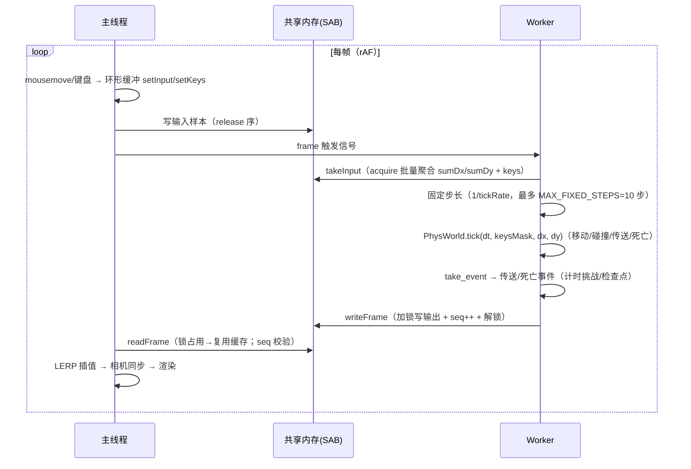

# WebSurf debug 工程时序（主线程 ↔ Worker 物理循环）

> 对应 `debug/`（Debug Build）。渲染在主线程，物理在 Worker（WASM Rust 物理）。
> game 的时序（主线程唯一物理渲染线 + Worker 权威帧）见 `docs/timing-game.md`。

## 1. 线程职责

| 线程 | 职责 | 关键文件 |
|---|---|---|
| 主线程 | 输入采集（Pointer Lock → 环形缓冲）、渲染（three.js）、面板/UI | `src/app.ts`、`src/renderer/*` |
| Worker | BSP 解析（WASM）、物理世界构建、固定步长物理循环、共享输出 | `src/worker/*` |
| WASM | BSP 解析 / GLB 导出 / `PhysWorld` 物理 | `crates/wasm` + 共享层 |

## 2. 跨线程数据通道（`src/worker/shared-state.ts`）

```
SharedArrayBuffer（crossOriginIsolated 时；否则 MsgState postMessage 回退，接口等价）
├─ Int32 控制区：lock / outSeq / inHead / inTail / onGround / mode
├─ Float64 输出区：pos / yaw / pitch / vel / timeMs / eyeHeight（seqlock：加锁写 → 版本号 → 解锁）
└─ 输入环形缓冲（SPSC，64 槽 SOA）：dxs / dys / tss（Float64）+ keys（Int32）
    内存序：写者先写槽数据 → Atomics.store(tail)（release）；读者 load(tail)（acquire）→ 批量读快照
    满则覆盖最旧（自动降采样）；积压 ≥ 8 → Atomics.notify 唤醒
```

## 3. 加载时序（地图加载一次）

```
主线程                          Worker
  │ 读 .bsp 字节                  │
  ├─ postMessage(load-bsp, transfer) ──→ BspProcessor(bytes)
  │                                ├─ parse_spawn_points / parse_teleports / parse_pvs_data
  │                                ├─ export_brushes_planes / export_model_*（借用）
  │                                ├─ export_mosaic_manifest / export_missing_textures（借用）
  │                                ├─ 加载默认纹理包（内嵌 mtzB64 或 fetch）→ decompress_mtz
  │                                ├─ export_glb_with_pakfile_models_with_defaults（消费 BSP）
  │                                ├─ PhysWorld.build_world(brush/tri/teleport/spawn)
  │                                └─ scene-data（GLB 字节 transfer + 各 JSON）──→ 主线程
  ├─ GLTFLoader 建场景 + LOD/PVS/lightmap
  ├─ 缺失纹理弹窗（比对默认纹理包；回退已在 GLB 导出期完成）
  └─ 进入渲染循环
```

## 4. 运行时序（每帧）



**输入链路**（`src/worker/physics-loop.ts`）：
- 鼠标增量在 TS 侧乘灵敏度（`config.input.sensitivity`），Rust 端 `sensitivity` 固定 1（`set_params` 同步），`tick` 内部 `yaw -= dx × M_YAW`。
- Q/E（yawLeft/yawRight）在 TS 转**等效像素量**（`yawBindSpeed × dt / M_YAW`）并入 dx——独立增量不受灵敏度影响。
- noclip 模式不进入 Rust 物理：TS 侧 `noclipView` 自由飞行（移动/视角），切回 physics 时 `set_state` 继承位置与视角（速度清零）。

**物理后处理**（Worker `onAfterPhysics`）：
- 游戏计时（`GameState.onPlayerMove`）、传送事件 → 检查点/完成检测（`take_event`）、死亡 → 检查点回退（`getRespawnPos` + `teleport_to`）、周期 stats（10Hz）。

## 5. 物理参数链路

```
面板（侧边栏）→ set-physics-param / set-hull 消息 → Worker
  └─ PhysicsParams（src/physics/physics-params.ts）
       ├─ 参数名映射表 → set_params(snake_case JSON patch) → PhysWorld
       ├─ 碰撞箱 → set_hull(halfWidth, standHeight, duckHeight)
       └─ tickRate → physics-loop.setTickRate（固定步长，不进 Rust）
```

可调参数子集（与共享层 `PhysParams` 对应）：maxSpeed→run_speed、walkSpeed、crouchSpeed、airAccelerate、gravity、accelerate、friction、stopSpeed、jumpHeight、autobhop、bhopSpeedClamp、noPrestrafe、tickRate（JS 层）。

## 6. 输出消费（主线程）

- `readFrame` 快照 → 双快照 LERP（`prevSnap/curSnap`）→ 相机（`pos.y + eyeHeight`）。
- 传送/重生/模式切换 → `resetInterpolation()` 清缓存。
- 近平面贴墙自适应（6 方向探测收缩 near，防透视穿墙）。
