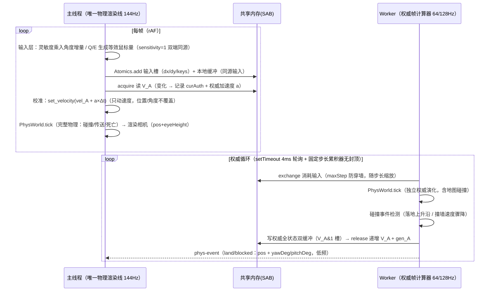

# WebSurf game 工程时序（主线程唯一物理渲染线 + Worker 权威帧）

> 对应 `game/`（WebSurf-game）。与 debug 的时序**不同**：物理在主线程（唯一物理渲染线），
> Worker 仅作**权威帧计算器**。debug 时序见 `docs/timing-debug.md`。

## 1. 线程职责

| 线程 | 职责 | 关键文件 |
|---|---|---|
| 主线程 | BSP 解析（WASM）、**唯一物理渲染线**（PhysWorld tick + 渲染同频）、输入层、面板 | `src/app.ts`、`src/renderer/renderer-main.ts` |
| Worker（权威帧） | wasm 世界构建 + 独立固定步长权威物理（64/128Hz），输出权威全状态 | `src/worker/main.ts`、`src/worker/shared-state.ts` |

## 2. 双通道（`src/worker/shared-state.ts`）

- **ShmState（SAB，crossOriginIsolated 时）**：输入槽（dx/dy BigInt64 原子累加 + keys）+ 权威全状态**双缓冲**（pos/yaw/pitch/vel/eyeHeight/timeMs，10 值/槽，`V_A` 版本号 + `gen_A` 代际校验）。
- **MsgState（postMessage 回退，file:// / 静态部署无 COOP/COEP）**：主线程每帧发 `input` 消息；Worker 每 tick 发 `phys-frame` 消息（`recvFrame` 缓存）。功能等价、性能降级。

## 3. 加载时序

```
主线程
  ├─ 读 .bsp → BspProcessor（主线程解析）
  ├─ 借用导出（brush/tri/teleport/spawn/pvs）→ scene-data（GLB + JSON）
  ├─ 默认纹理包（内嵌 mtzB64 或 fetch）→ decompress_mtz
  ├─ export_glb_with_pakfile_models_with_defaults（缺失回退在导出期嵌入）
  ├─ renderer.buildPredictionWorld（主线程 PhysWorld：渲染物理线）
  ├─ postMessage world-json → Worker（权威 PhysWorld：world-json 构建）
  ├─ set-spawn-points → Worker（teleport_to_spawn 用）
  └─ 渲染循环
```

## 4. 运行时序（v7 定案：权威帧计算模式）



### 校准与兜底

| 机制 | 规则 |
|---|---|
| 每帧校准 | `set_velocity(vel_A + a×Δt)`（权威速度 + 加速度外推）；**位置/角度不覆盖**——渲染帧永远是主线程物理的连续输出 |
| 碰撞事件 | `phys-event`（land/blocked）→ 位置微调（差 <60）+ 角度同步 |
| 位置突变 | respawn / teleport：双端同执行 + `player-respawn` 回传归零 |
| 兜底同步 | 渲染主线 → 权威反向同步（渲染 144Hz 精度更高）：dist>500 或 yaw 分叉 >45° 等三条件 OR，250ms 冷却，同步中再分叉则回滚以权威为准 |
| 角度隔离 | 权威帧不得影响渲染角度；Q/E 输入层化后双端同源 → 天然一致 |

## 5. 输入层（`src/app.ts` + `input-bridge.ts`）

- 灵敏度：主线程 mousemove 乘入角度增量（`dx × sens`），物理两端 `sensitivity` 固定 1——改灵敏度不产生双端分叉。
- Q/E：`yawBindSpeed / M_YAW × dt` 等效像素量并入 dx（不受灵敏度影响）。
- 同一份输入同时喂：SAB 输入槽（权威）+ 主线程本地缓冲（渲染物理）——双端同源无分叉。

## 6. 面板参数链路

```
ESC 面板（panel-controller.ts）→ input-bridge.sendConfig(section, patch)
  ├─ 主线程：renderer.setPredictionParams / setPredictionHull（渲染物理即时生效）
  ├─ Worker：config 消息 → applyConfigPatch（权威参数）→ set_params / set_hull
  └─ tickRate：显式传给 Worker（fixedDt = 1/tickRate，改档即时生效）
```

## 7. 文件:// 运行（single 打包）

- 无 crossOriginIsolated → MsgState 回退（权威帧经消息）。
- WASM base64 内嵌（`__VBSP_WASM_B64__`）→ 主线程/Worker 均 `initSync({module})`。
- Worker 代码内嵌（`__VBSP_WORKER_JS__`）→ Blob URL（module worker 在 file:// 被 CORS 拦截）。
- 默认纹理包内嵌（`__VBSP_TEXTURES_MTZ_B64__`，主线程直接读——game 的解析/导出/回退均在主线程，无消息传递需求）。
