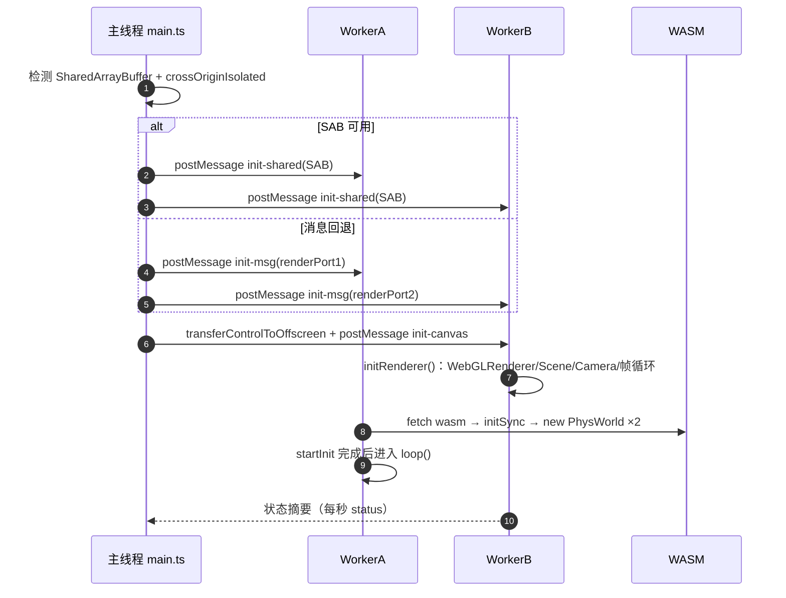
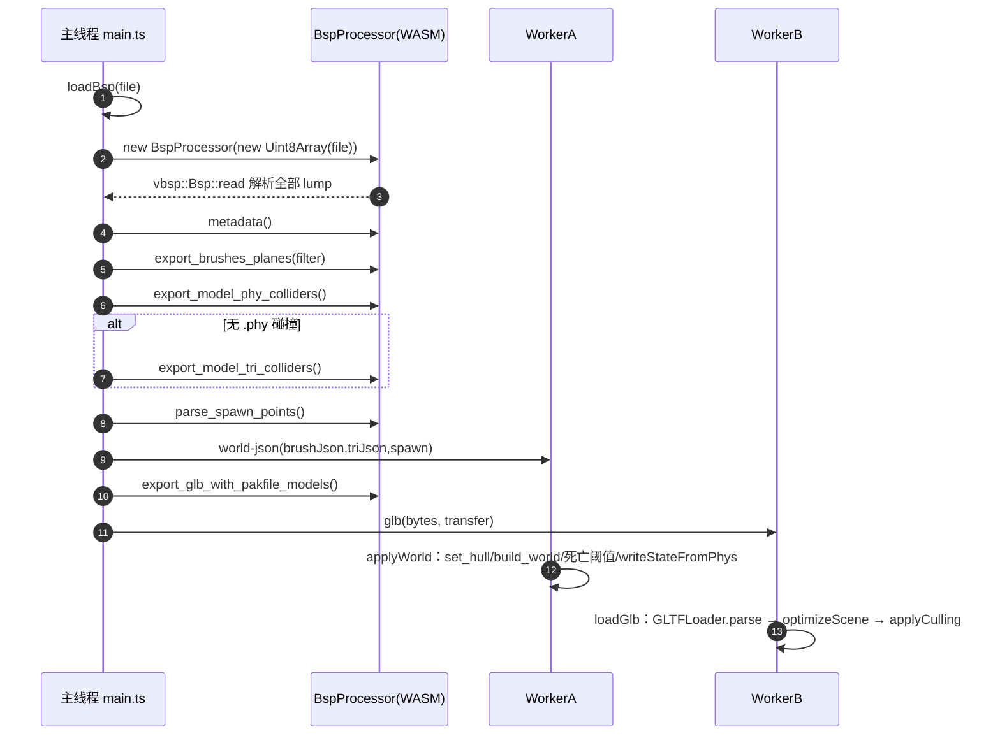
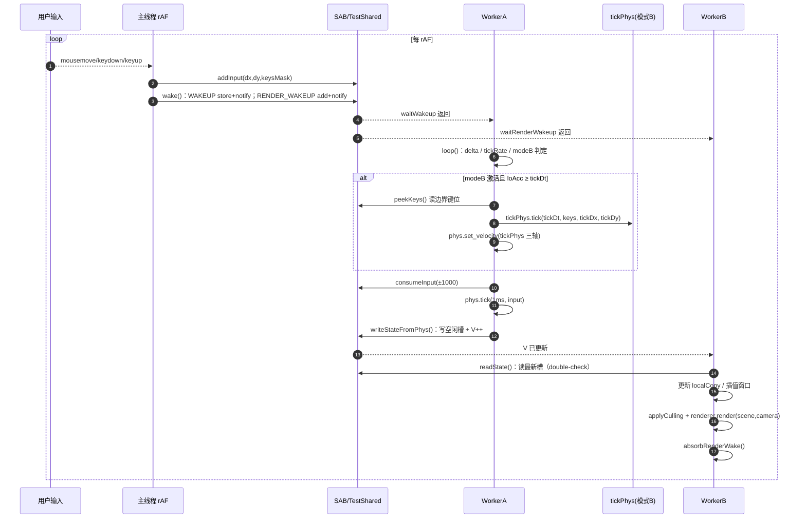
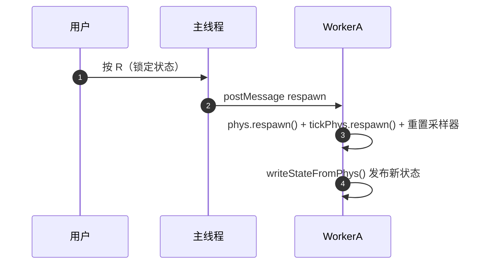

# 运行时序图

> 以下时序图使用 Mermaid `sequenceDiagram`。每张图后附按节点编号的分节说明。
> 节点编号与图中 `autonumber` 序号一一对应。

## 1. 启动与握手

### 节点说明

1. **主线程前置检测**：`SharedArrayBuffer` 存在且 `crossOriginIsolated === true` 时使用 SAB 模式；否则进入消息回退模式。HUD 会提示当前通道模式。
2. **SAB 模式共享内存**：`TestShared.create(sab, workerA)` 创建 192B SAB 并 `postMessage` 给 WorkerA；WorkerB 也收到同一 SAB（SAB 不能放 transfer list，只能结构化克隆共享）。
3. **消息回退模式**：主线程与 WorkerA 用 `msg-main` 消息；WorkerA 与 WorkerB 之间建立 `MessageChannel` 直连，状态发布不经过主线程中转。
4. **OffscreenCanvas 移交**：主线程 `transferControlToOffscreen()` 后把控制权 transfer 给 WorkerB；此后 WebGL 渲染完全在 WorkerB 内完成，主线程只保留事件/指针锁定能力。
5. **WorkerB 初始化**：创建 three.js 渲染器、场景、相机、光照、TraceRenderer，并通过 `resumeChannel.port2.postMessage(null)` 启动帧循环自驱。
6. **WorkerA 初始化**：`init-shared` 触发 `startInit()`，fetch wasm、`initSync`、创建 `phys` 与 `tickPhys` 两个 `PhysWorld`；若 `world-json` 先到则暂存 `pendingWorld`。
7. **WorkerA 循环启动**：wasm 就绪后进入 `loop()`；之后以 setTimeout(0) 自驱 + `waitWakeup` 背压。
8. **状态摘要回传**：WorkerB 每秒通过 `status` 消息回传 pos/vel/yaw/pitch/GLB 状态/渲染帧率，主线程更新 DOM HUD。

## 2. BSP 地图加载

### 节点说明

1. **文件入口**：`bspFileInput` change → `loadBsp(file)`；先显示“正在解析”。
2. **WASM 解析**：`new BspProcessor(bytes)` 内部调用 `vbsp::Bsp::read()`，解析全部 lump 并校验；失败会抛 JS 错误并在 HUD 显示。
3. **元数据**：`metadata()` 返回 magic、各 lump 计数、packed_files 等，用于 HUD 状态。
4. **brush 碰撞体**：`export_brushes_planes(BRUSH_FILTER_JSON)` 导出玩家碰撞 brush 的凸包平面 JSON，WorkerA 用它构建物理世界。
5. **模型碰撞优先 `.phy`**：`export_model_phy_colliders()` 解析 PAKFILE 内模型自带的 vphysics 碰撞体。
6. **模型碰撞回退**：若 `.phy` 结果为空数组，则调用 `export_model_tri_colliders()`，用可视网格生成碰撞三角形。
7. **出生点**：`parse_spawn_points()` 返回出生点列表与 primary；主线程取首个可用出生点，并把 yaw 转成 cs-movement 方向。
8. **world-json 分发**：主线程把 brush/tri/spawn 打包发给 WorkerA；WorkerA 内部使用空 teleport report 构建世界，确保不注册任何传送区域；若 wasm 未就绪会暂存。
9. **GLB 导出**：`export_glb_with_pakfile_models()` 会消费 Bsp 实例，因此必须在所有借用方法之后调用。
10. **GLB 分发**：`ArrayBuffer` 通过 transfer 零拷贝给 WorkerB。
11. **WorkerA 建世界**：`applyWorld()` 调用 `set_hull(16,72,54)` 与 `build_world(...)`，并设置死亡阈值；`tickPhys` 同步构建同一世界；随后 `writeStateFromPhys()` 让首帧状态立即可见。
12. **WorkerB 挂载场景**：`loadGlb()` 用 GLTFLoader 解析，成功回调后 `optimizeScene()` 做空间分块合并，再 `assignMeshCullingData()` + `applyCulling(true)`。

## 3. 常规帧循环（稳态）

### 节点说明

1. **输入事件累积**：mousemove 只累加到主线程本地 `mouseDx/mouseDy`，keydown/keyup 只更新 `keyState`；高频事件不直接触碰 SAB。
2. **写入输入槽**：每个 rAF 一次性 `addInput(dx,dy,keysMask)`——鼠标增量用 BigInt64 定点原子累加，键位掩码用 Int32 覆盖写。
3. **双槽唤醒**：`wake()` 同时做两件事：
   - `WAKEUP`：`store(1)+notify(1)`，WorkerA 背压 `wait` 立即返回；
   - `RENDER_WAKEUP`：`add(1)+notify(1)`，WorkerB 帧循环被唤醒，且计数语义保证渲染频率 ≤ 刷新率。
4. **WorkerA 被唤醒**：`waitWakeup` 返回并 CAS 复位；若在休眠期间没有新输入也会因主线程 rAF 唤醒。
5. **WorkerB 被唤醒**：`waitRenderWakeup` 消费计数差值；随后进入一帧采样/渲染。
6. **WorkerA 计算 delta 与模式判定**：`delta` clamp 到 `[0,0.05]`；读 `TICK_RATE` 判断 `modeBActive`；停用→激活边沿会重置累积器并 `alignTickPhys()`。
7. **tick 边界**：`loAcc ≥ tickDt` 时执行模式B；键位取边界当前掩码，鼠标取模式A 自上一边界消耗的累积增量（限幅）。
8. **tick 实例推进**：`tickPhys.tick(tickDt, ...)` 是独立 64t 物理演化；若与模式A 位置偏差超过 64，先 `alignTickPhys()` 全量拉回。
9. **速度校准**：`phys.set_velocity(tickPhys 三轴速度)` 是模式B 对模式A 的唯一影响通道；位置/角度不触碰。
10. **模式A 消费输入**：`consumeInput(±1000)` 是唯一输入消费路径；tick 边界采样所需鼠标增量在这里累积到 `tickDxAcc/tickDyAcc`。
11. **模式A 子步**：`phys.tick(1ms, keysMask, dx, dy)` 推进位置/角度/速度；每轮最多 8 步，累加器封顶 20ms。
12. **状态发布**：`writeStateFromPhys()` 写“当前 V 的另一槽”再 `Atomics.add(V,1)`；发布不 notify RENDER_WAKEUP（渲染主驱动是主线程 rAF）。
13. **WorkerB 看到 V 更新**：`readState()` 返回非 null，进入状态刷新分支。
14. **WorkerB 采样**：acquire 读 V → 读当前槽 → 重读 V double-check 防撕裂；更新 `localCopy` 与插值窗口。
15. **渲染**：`applyCulling()` 应用距离 LOD（最小集不启用 PVS）后 `renderer.render(scene,camera)`；相机位置为 `pos + EYE_STAND`，欧拉角 `'YXZ'`。
16. **吸收唤醒**：`absorbRenderWake()` 合并丢弃渲染期间到达的 RENDER_WAKEUP 信号，避免忙循环超过刷新率。

## 4. 补充：R 重生

### 节点说明

1. **R 键**：仅指针锁定状态下生效；主线程直接 `postMessage({type:'respawn'})` 给 WorkerA。
2. **双实例重生**：`phys.respawn()` 与 `tickPhys.respawn()` 同步重置；`loAcc/tickDxAcc/tickDyAcc` 清零。
3. **立即发布**：重生后 `writeStateFromPhys()` 写一次新状态，WorkerB 下一帧可见。
