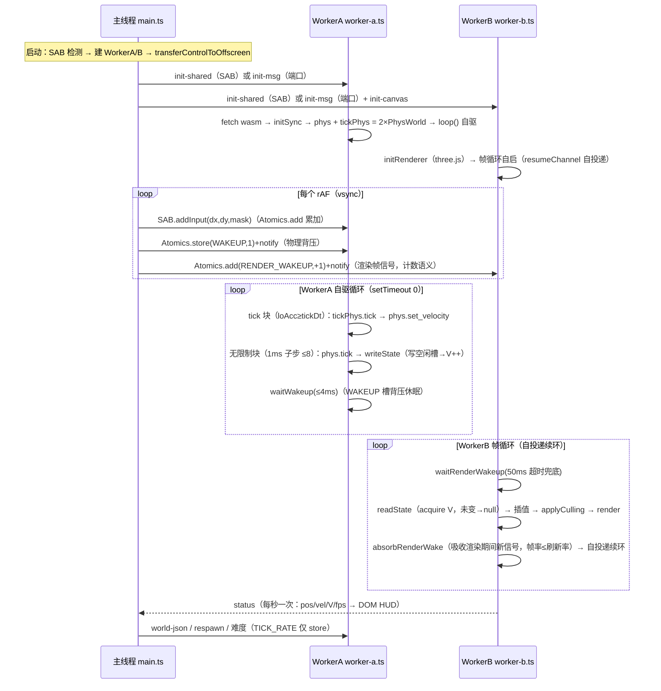

# WebSurf-test 核心时序（维度 T）

> **事实基准**：本文所有论断核对自当前工作区代码（核对日期 2026-09-07）。未注明前缀的相对路径均相对 `test/dual-mode-harness/`；仓库根共享层以 `仓库根 src/…` 标注。整体架构与模块划分见 [./overview.md](./overview.md)。

## 1. 全局时序图



## 2. 启动链

1. **页面加载**：`index.html:94` `<script type="module" src="./app.js">` → esbuild bundle 自 `src/main.ts`（`package.json:10`）。
2. **前置检测与模式选择**（`src/main.ts:74-100`）：`typeof SharedArrayBuffer !== 'undefined'` 且 `crossOriginIsolated === true` → 共享内存模式；否则消息回退模式（HUD 显示通道提示，`src/main.ts:102-109`）。
3. **创建双 Worker**（`src/main.ts:83-86`）：module worker（`new URL('./worker-a.js', import.meta.url)`）。SAB 模式：`new SharedArrayBuffer(192)` → `TestShared.create(sab, workerA)`（postMessage 共享 SAB——SAB 不可进 transfer list，`src/main.ts:92`）+ 向 WorkerB `init-shared`（`:93`）。消息回退：`TestShared.createMessaging(workerA)`（`:95`）+ `MessageChannel` 直连端口分别发给 WorkerA/WorkerB（`:97-99`，状态发布不经主线程中转）。
4. **渲染控制权移交**（`src/main.ts:147-159`）：`canvas.transferControlToOffscreen()` → `{type:'init-canvas'}` transfer 给 WorkerB；窗口 resize → `resize` 消息。transfer 后原 canvas 元素仍可接收事件与指针锁定（`src/main.ts:148` 注释）。
5. **WorkerA 初始化**（`src/worker-a.ts:190-210`）：收到 `init-shared`/`init-msg` → `startInit()`（幂等）→ fetch `./websurf_test_wasm_bg.wasm`（`DEFAULT_WASM_URL`，`:65`）→ `initSync({module})` → **创建两个 PhysWorld**（`phys` = 模式A，`tickPhys` = 模式B，`:200-201`）→ 若 `world-json` 先于 wasm 到达则此时应用暂存（`pendingWorld`，`:202-205`）→ `loop()` 自驱。
6. **WorkerB 初始化**（`src/worker-b.ts:207-241`）：`initRenderer` 建 WebGLRenderer（antialias、`powerPreference:'high-performance'`、pixelRatio 固定 1）+ Scene（背景/雾）+ 透视相机（初始位置 (0, 64.09, 0)）+ 基础光照（ambient 0.6 + directional 0.8）→ `resumeChannel.port2.postMessage(null)` 启动帧循环（`:218`）。
7. **默认难度**（`src/main.ts:162-164`）：`DEFAULT_RATE = 64` → `shared.writeTickRate(64)`（仅 store）。

> WASM 初始化统一走 **`initSync({module})` 同步实例化**（`src/worker-a.ts:199`、`src/main.ts:187`）。

## 3. 主线程 rAF 输入循环（阶段1）

**帧体**（`src/main.ts:354-364`）：

```
frame(): requestAnimationFrame(frame)
  → 取本地累积的 dx/dy 并清零
  → mask = locked ? keysToMask(keyState) : 0     // 未锁定强制 0（防 ESC 残留输入）
  → shared.addInput(dx, dy, mask)                 // SAB Atomics.add 累加 / 消息回退批投递
  → shared.wake()                                 // 双槽通知（见 §5）
```

**输入捕获层**（每事件只写本地变量，不触碰 SAB）：

| 环节 | 实现 | 出处 |
|---|---|---|
| Pointer Lock | 点击画布请求；优先 `{unadjustedMovement:true}` 禁用 OS 鼠标加速，不支持则降级普通锁定 | `src/main.ts:273-275,46-68` |
| 锁定状态变化 | `discardNextMouse = true`（丢弃下一个 mousemove——锁定初始跳变通常 2000-5000+ px）；退锁清空全部残留输入 | `src/main.ts:281-291` |
| mousemove 累积 | 仅锁定时累积；每事件先 `discardNext` 再 ±1000 绝对削平（保留方向与大部分量级） | `src/main.ts:28,296-304` |
| 键盘 | WASD/方向键/空格 → `keyState` 五布尔；R（非 repeat）→ `postMessage({type:'respawn'})` 到 WorkerA | `src/main.ts:260-270,307-324` |
| 失焦清理 | `blur` → 清键位 + 鼠标增量 | `src/main.ts:326-330` |
| 难度按钮 | `shared.writeTickRate(rate)` 仅 store 无 notify；按钮组 关/32/64/128/256/1000 | `src/main.ts:332-347`、`index.html:78-85` |

## 4. WorkerA 双模物理循环（阶段2）

**每轮结构**（`src/worker-a.ts:213-308`，逐字语义）：

```
loop():
  delta = clamp((now-lastNow)/1000, 0, 50ms)                 // :217-221
  tickRate = shared.readTickRate()
  modeBActive = tickRate > 0 && 1/tickRate > RENDER_DT(1ms)   // :224-226
  停用→激活边沿：loAcc/tickDxAcc/tickDyAcc 清零 + alignTickPhys（tickPhys 对齐模式A 全状态）  // :228-238

  ── 第一步：tick 计算（先，:241-273）──
  if modeBActive:
    loAcc += delta
    while loAcc >= tickDt:                                    // tick 节点到达才执行
      loAcc -= tickDt
      采样：keys = peekKeys()（边界当前键位掩码，非消耗）      // :248
            dx/dy = tickDxAcc/tickDyAcc（自上一边界模式A 实时消耗的累积增量，±tickMax 限幅）  // :249-253
      if tickDiverged(): alignTickPhys()                      // 分叉兜底锚定（:259-261）
      tickPhys.tick(tickDt, tickKeys, tickDx, tickDy)         // 独立 64t 演化（:264）
      phys.set_velocity(tickPhys 三轴速度)                    // 速度校准（唯一 tick 影响通道，:268-269）
  else: loAcc = 0                                             // TICK_RATE=0 / ≥1000Hz → 纯模式A（:272）

  ── 第二步：无限制计算（后，:276-297）──
  acc += delta
  while acc >= RENDER_DT && steps < MAX_STEPS_PER_ROUND(8):   // 大 delta 防死亡螺旋
    acc -= RENDER_DT
    inp = shared.consumeInput()                               // 唯一 SAB 输入消费路径（缺省不限幅，:285）
    if modeBActive: tickDxAcc/tickDyAcc += inp.dx/dy          // tick 边界采样累积（:288-291）
    phys.tick(RENDER_DT, inp.keysMask, inp.dx, inp.dy)        // 1ms 子步（:292）
    writeStateFromPhys()                                      // 共享槽唯一写入者 = 模式A（:293,153-164）
  if acc > MAX_ACC(0.02): acc = MAX_ACC                       // 上限耗尽封顶，剩余下轮补跑（:295-296）

  ── 背压休眠（:301-307）──
  idleMs = (RENDER_DT - acc) × 1000
  if idleMs ≥ 1ms: shared.waitWakeup(min(idleMs, 4ms))        // 挂起 WAKEUP 槽，可被 wake 提前唤醒
  setTimeout(loop, 0)                                         // 让出事件循环投递消息，续环
```

深度解析（双实例、边界采样、锚定、速度校准的设计动机）见 [./implementation/dual-physics.md](./implementation/dual-physics.md)。

## 5. 唤醒协议：双槽分离（WAKEUP vs RENDER_WAKEUP）

`wake()`（`src/shared-state.ts:305-313`）一次通知两槽，语义不同：

| 槽 | 写法 | 等待方 | 等待/消费 | 设计语义 |
|---|---|---|---|---|
| `[1] WAKEUP` | `Atomics.store(1)` + `notify`（电平） | WorkerA `waitWakeup`（`:323-331`） | `Atomics.wait(WAKEUP,0,timeout)`；返回后 CAS(1→0) 消费复位；`timed-out` 跳过复位（保留窗口内新唤醒） | **物理背压**：WorkerA 多数轮次挂起，缩短空转 |
| `[7] RENDER_WAKEUP` | `Atomics.add(+1)` + `notify`（**计数**） | WorkerB `waitRenderWakeup`（`:344-358`） | 快路径比对计数；`wait(RENDER_WAKEUP, lastRenderWake, timeout)`；醒来消费差值 | **渲染帧信号**：主线程每 rAF +1，与 vsync 同相 |
| `[7]` 渲染后 | `absorbRenderWake()`（`:366-369`） | WorkerB 渲染完成后调用 | 吸收（合并丢弃）渲染期间新到的计数 | 渲染频率严格 = min(刷新率, GPU 耗时)，杜绝忙循环超限 |

**为什么 WorkerA 发布状态不 notify 渲染**：1kHz 随机相位唤醒会让渲染完成时刻与显示器 BeginFrame 错位 → 呈现时间不规则（「60 f/s 却观感 ~20f」的抖动根因）。因此 `writeStateRaw` 只写槽 + `V++`、**不再 notify**（`src/shared-state.ts:503-507` 注释）；WorkerB 醒后只读最新槽，V 未变不重绘。渲染的主驱动 = 主线程 rAF 帧信号；主线程停摆（隐藏标签页）时 WorkerB 以 50ms 超时兜底自驱（`src/worker-b.ts:608-617,651`）。

## 6. 双缓冲状态槽读写协议

**写路径**（WorkerA，`src/shared-state.ts:458-509`）：`writeState` → `writeStateRaw`（`:459` 委托）——读 V0 → 写**空闲槽** `S[(V0&1)^1]`（不覆盖 WorkerB 正在读的槽，8 个 Float64：pos×3/vel×3/yaw/pitch）→ `Atomics.add(V,1)`。调用方 `writeStateFromPhys`（`src/worker-a.ts:153-164`）：`phys.state()` → `shared.writeState(...)`。

**读路径**（WorkerB，`src/shared-state.ts:518-547`）：acquire 读 V → 与 `lastV` 相同返回 null（非阻塞，重绘判定「仅状态更新时重绘」）→ 不同则读当前槽 `S[V&1]` 全部字段 → **double-check**：重读 V，若写入方在字段读取期间推进了版本则以新版本重读（最多 2 次尝试；8 个连续 Float64 读远快于 1ms 物理子步，竞争几乎不可能命中）。

布局细节与 dyAcc/V 重叠事故记录见 [./implementation/shared-layout.md](./implementation/shared-layout.md)。

## 7. WorkerB 帧信号渲染循环（阶段3）

**循环骨架**（`src/worker-b.ts:648-662`）：

```
resumeChannel.port1.onmessage:
  if shared:
    waitRenderWakeup(50ms)      // 主驱动 = 主线程 rAF 帧信号；超时 = 停摆兜底
    repainted = frameTick()     // try/catch 保护（:631-639），单帧异常不中断循环
    absorbRenderWake()          // 渲染期间新到信号合并丢弃
  if 消息回退模式 && !repainted:
    setTimeout(() => postMessage(null), 100ms)   // 无新状态降频自检（MSG_IDLE_INTERVAL_MS，:617）
  else:
    postMessage(null)           // 自投递续环（消息任务无 setTimeout 4ms 嵌套钳制，:619-624）
```

**单帧处理 `onFrame`**（`src/worker-b.ts:672-717`）：

1. `readState()` 非阻塞采样：V 更新 → 读最新槽（无撕裂）→ 推进插值窗口（`interpLast ← interpCur`，`interpCur ← 新状态`，时间戳 = 收到时刻）→ `localCopy = state`（本地副本唯一更新来源，`:688-690`）；V 未变 → 走插值。
2. 消息回退模式无新状态 → 直接返回不渲染（节流，`:696`）。
3. 渲染参数 = 状态间**线性插值**（`:703-710`）：alpha = (now - interpLastT)/span；状态到达帧 alpha=1 直接用最新权威（现役 surf_666 物理约 1kHz 发布 > 刷新率，每次唤醒都有新状态，alpha 恒 1）；仅物理发布 < 刷新率时产生中间帧。`interpolateState` yaw 走最短路径环绕并归一化到 [-180,180)（`:720-743`）。
4. `applyCulling(renderState)` 距离 LOD（`:714`）→ `render(renderState)`（`:715`）。

**相机映射**（FPS 约定，`src/worker-b.ts:746-754`）：`camera.rotation.set(pitch·DEG2RAD, yaw·DEG2RAD, 0, 'YXZ')`；`camera.position.set(pos.x, pos.y + EYE_STAND, pos.z)`，EYE_STAND = 64.09 固定站立眼高（状态槽无 eyeHeight，不处理蹲伏，`:108-109`）。

**渲染统计与 HUD**（`:757-779`）：每秒结算 frames/repaints → `postMessage({type:'status'})` → main 更新 DOM 文本（OffscreenCanvas 只能挂一个 context 且已被 WebGL 占用，HUD 由页面 DOM 承载，`:35-36`；main 侧 `src/main.ts:128-145`）。

## 8. BSP 地图加载时序

`loadBsp`（`src/main.ts:203-252`，文件选择触发 `:249-252`）：

```
ensureMainWasm()            // 主线程 wasm 懒初始化：fetch './websurf_test_wasm_bg.wasm' → initSync（:180-191）
await setTimeout(0)         // 先让 UI 刷新（:207）
proc = new BspProcessor(bytes)                    // 立即解析（lib.rs:326-334）
meta = proc.metadata()                            // 元数据 JSON（借用）
brushJson = proc.export_brushes_planes(FILTER)    // brush 凸包（借用）
triJson = proc.export_model_phy_colliders()       // 模型碰撞：.phy 优先
if 空: triJson = proc.export_model_tri_colliders()  // 可视网格回退（:213-216，与 game colliderSource=auto 等价）
spawnJson = proc.parse_spawn_points()             // 借用导出最后一步
spawn = 首个出生点（primary 优先；origin 已 Y-up；yaw = bspYawToCsYaw）  // :219-228
workerA.postMessage({type:'world-json', brushJson, triJson, spawn})     // :231
glb = proc.export_glb_with_pakfile_models()       // &mut 消费内部 Bsp 实例（lib.rs:1685-1688 .take()）
workerB.postMessage({type:'glb', bytes}, [bytes])  // transfer 零拷贝（:234-237）
```

三处关键约束（均与 Rust 侧契约一致）：

1. **借用导出必须先于 GLB 导出**：`export_glb_with_pakfile_models` 会消费内部 Bsp 实例（`crates/wasm/src/lib.rs:311-314,1685-1688`）。
2. **brush 过滤 JSON**（`src/main.ts:171-177`）：`{include_ladder:true, include_solid:true, min_brush_volume:0, skip_sky:true, skip_nodraw:false}`（字段缺省用默认值，`crates/wasm/src/lib.rs:346-356`）。
3. **传送区域明确排除**：WorkerA 收到的世界不含 teleport——`applyWorld` 传空 report `EMPTY_TELEPORT_JSON = '{"teleports":[],"triggers":[]}'`（`src/worker-a.ts:67,130`）；主线程流程不调用 `parse_teleports/parse_pvs_data`（`crates/wasm/src/lib.rs:18-19`）。

**WorkerA 应用世界**（`applyWorld`，`src/worker-a.ts:126-151`）：`set_hull(16,72,54)` → `build_world(brushJson, triJson, 空teleport, spawn)`（双实例同步构建，`:129-135`）→ 死亡阈值 = brushJson 最小 `min[1] - 100`（`:137-146`）→ `writeStateFromPhys()` 首帧状态即刻可见（`:150`）。

**WorkerB 挂载 GLB**（`src/worker-b.ts:252-282`）：`GLTFLoader.parse`（无需 DOM）→ 替换旧 modelRoot（逐 mesh dispose 防泄漏，`:285-298`）→ 清根节点旋转（`:301-309`）→ `optimizeScene()` 空间分块合并 → `assignMeshCullingData()` → `applyCulling()`。GLB 内嵌纹理在 Worker 内经 createImageBitmap 解码、外部 URL 贴图由 fetch 加载，个别贴图报错不影响场景挂载（头注 `src/worker-b.ts:10-12`）。

## 9. respawn（阶段4）

R 键（非 repeat）→ `workerA.postMessage({type:'respawn'})`（`src/main.ts:315-317`）→ WorkerA：`phys.respawn()` + `tickPhys.respawn()`（双实例同步）+ 清 loAcc/tickDxAcc/tickDyAcc + `writeStateFromPhys()`（写空闲槽 + V++，`src/worker-a.ts:327-337`）。世界重建（`world-json`）同样走双实例同步（`applyWorld`）。

## 10. 消息回退模式时序差异（无 SAB 环境）

| 环节 | SAB 模式 | 消息回退模式（`src/shared-state.ts:37-46,163-265`） |
|---|---|---|
| 通道 | 192B SAB 原子操作 | postMessage；`shared-input`（每 rAF 一批）/ `shared-tick-rate` / `shared-state` 三种载荷与 SAB 槽语义一一对应（`:140-161`） |
| WorkerA 自驱 | `waitWakeup` 背压 + `setTimeout(loop,0)` | `waitWakeup` 立即返回 false（无阻塞原语），纯 `setTimeout(loop,0)` 自旋（`src/shared-state.ts:324-325`；`src/worker-a.ts:34-35` 头注） |
| 输入消费 | SAB BigInt64 CAS 清零（`exchangeZero`，`:441-449`） | 本地累加变量直接读清（`onInputMessage` 填充 / `consumeInput` 消费，`:184-187,393-397,412-425`） |
| 状态发布 | 写槽 + V++，不 notify | 本地 V++ → 经直连 MessageChannel 投递 `SharedStateMsg`（结构化克隆，`:477-489`） |
| WorkerB 渲染 | 主驱动 = rAF wake 计数；50ms 兜底 | `waitRenderWakeup` 立即 false；仅新状态到达时渲染（`onFrame :696` 节流）；无数据时 100ms 低频自检，`shared-state` 到达立即触发循环（`src/worker-b.ts:181-192,655-658`） |
| 语义等价性 | — | V 版本/仅状态更新重绘/输入限幅/难度识别全部保留，仅传输介质不同（`src/shared-state.ts:46`） |

主线程 rAF 循环在消息回退模式照常运行，但 `addInput` 变为批投递、`wake()` 无操作（双 Worker 均消息自驱，`src/shared-state.ts:306-307`）。
